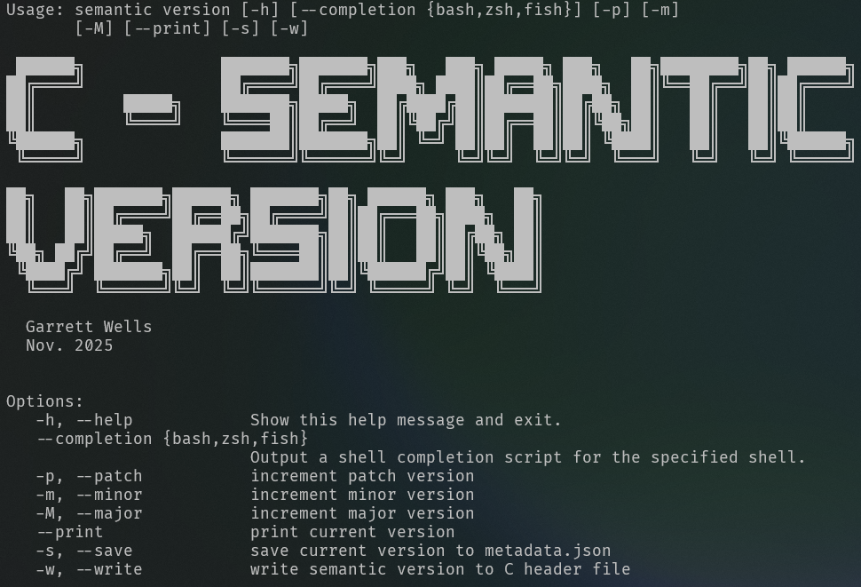

# C Semantic Version

This is a project to facilitate automatic generation of a version control header file containing a semantic version as C macros. It provides a simple workflow of:

1. Setup `metadata.json` with initial version/current version.
2. Use CLI to read `metadata.json`, increment chosen version number(Major, minor, patch), and then save the modified version string.
3. Include `version.h` and use the provided macros to build your version strings.

>[!example]
>```bash
>$ lua csemantic-ver.lua -M -s
>json:   {
>  "name":["Lancelot"],
>  "version":{
>    "minor":0,
>    "patch":0,
>    "major":1
>  }
>}
>[EXIT] json saved to file



# Dependencies

- Lua
    - `argparse`
    - `dkjson`
